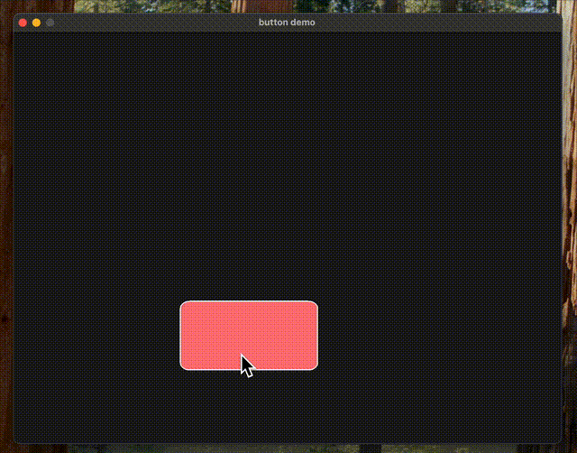

<div align="center">
  
  <h1>Edelweiss</h1>
  <p>Edelweiss is a lightweight game engine framework built with Python and OpenGL, designed to simplify the creation of 2D games.</p>
  <p><strong>Note: This project is currently in beta testing. Features may change, and there may be bugs. Contributions and feedback are welcome!</strong></p>
</div>

## Features

- Modular structure with separate classes for the game engine, scenes, and game objects.
- Support for basic shapes like squares and circles with customizable properties (position, color, scale).
- Scene management system for easy addition and manipulation of game objects.
- Basic animation and movement logic for objects.

## Technologies Used

- Python 3.x
- PyOpenGL
- GLFW
- NumPy

## Demo: Button Example



## Usage

This will launch a window displaying animated shapes.

<div align="center">
  
</div>

```python
from edelweiss import GameEngine, Scene, Square, Circle
import numpy as np

class MyScene(Scene):
    def __init__(self):
        super().__init__()
        self.time = 0.0

    def update(self):
        self.time += 0.010
        if "square1" in self.objects:
            self.objects["square1"].set_position(np.sin(self.time) * 0.5, 0.0)

if __name__ == "__main__":
    engine = GameEngine(800, 600, "edelweiss test")
    scene = MyScene()

    x = Square(name='square1')
    x.set_position(-0.5, 0.0)
    scene.add_object(x)

    engine.set_scene(scene)
    engine.run()
```

## Installation

1. Clone the repository:
```bash
git clone https://github.com/yourusername/Edelweiss.git
cd Edelweiss
```
2. Install dependencies (see requirements.txt):
```bash
pip install -r requirements.txt
```
3. Ensure you have a compatible OpenGL driver. On macOS the system may create a legacy OpenGL 2.1 context; Edelweiss handles this automatically.


## Quick Start

### macOS

```bash
python -m venv .venv
source .venv/bin/activate
pip install -r requirements.txt
# Optional audio support:
# brew install portaudio && pip install pyaudio
python main.py
```


### Linux

```bash
python -m venv .venv
source .venv/bin/activate
pip install -r requirements.txt
# Optional audio support:
# sudo apt install -y portaudio19-dev && pip install pyaudio
python main.py
```

## Examples

```bash
python example_square.py
python example_shapes.py
python example_button.py
# optional:
# python example_audio.py
```

## Troubleshooting

GLError 1282 / version '330' is not supported: your system created a legacy OpenGL 2.1 context. Edelweiss falls back to GLSL 120 and a no-VAO path on macOS/older drivers.

Editable install asks for Cython: editable mode is optional. If you need it: pip install Cython then pip install -e ..

macOS icon warning: “Cocoa: Regular windows do not have icons on macOS” — harmless, can be ignored.

## Contributing

Fork the repo and create a feature branch: git checkout -b docs/quick-start-and-i18n.

Make small, focused changes (docs, translations, minor fixes).

Run examples to smoke-test (python example_button.py, etc.).

Open a Pull Request describing what and why you changed.

Please prefer English for comments, logs, and docs to keep the project accessible for a global audience.